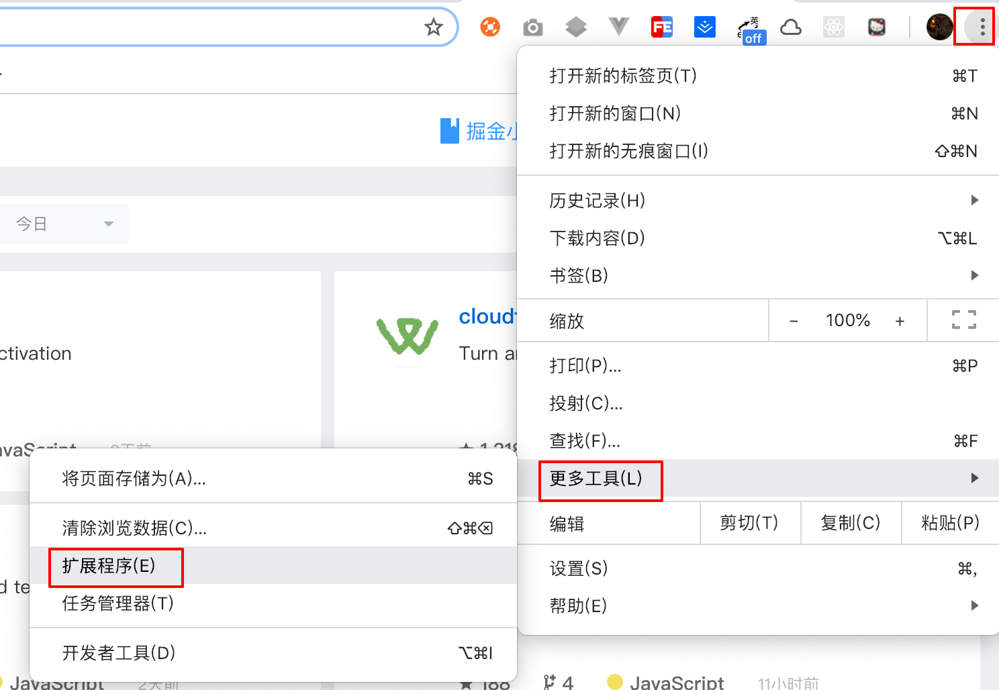
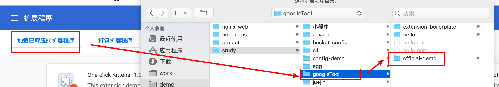
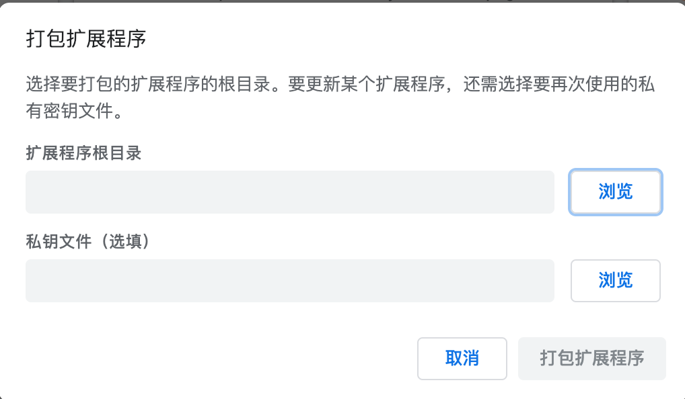
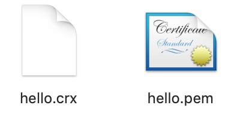
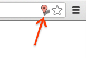
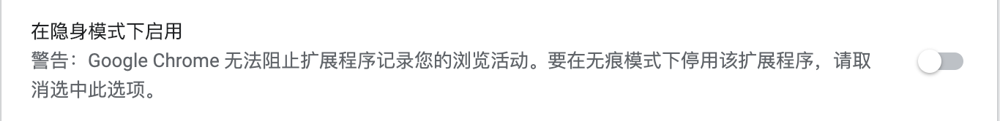
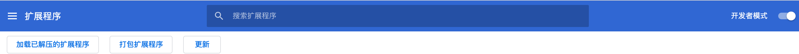
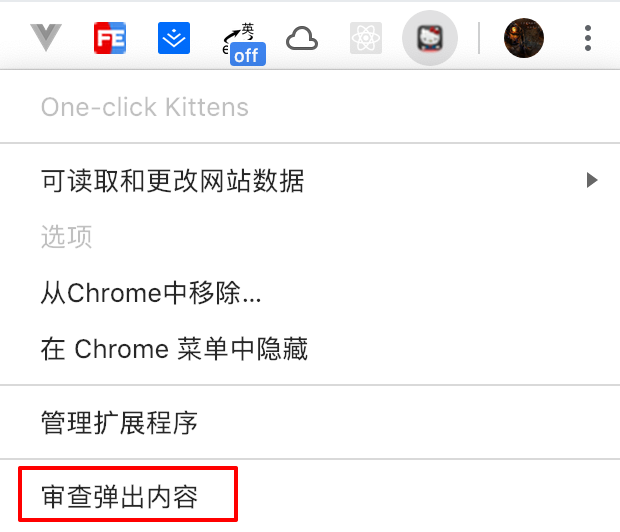

# Chrome插件入门

## 起步

[官网入门-需翻墙](https://crxdoc-zh.appspot.com/extensions/getstarted)
描述文件 manifest
```json
{
  "manifest_version": 2, // manifest的版本，1已经弃用，写死

  "name": "One-click Kittens", // 项目名称
  "description": "This extension demonstrates a browser action with kittens.",
  "version": "1.0",
  // 该插件会生效于哪个网址
  "permissions": ["http://*.google.com/", "https://*.google.com/"],
  "browser_action": { // 插件在浏览器上行为的描述
    "default_icon": "icon.png", // 右上角图标配置
    "default_popup": "popup.html" // 点击图标后显示的页面
  }
}
```
现在一个简单的插件就写好了，尝试把它放到浏览器去。




如果没问题会直接加载好了。

点击图标可以看到demo插件的`popup.html` 已展示出来

可以发现拓展插件页面有三个按钮: 加载、打包、更新。


> 一般可以认为: 加载已解压的拓展程序为开发时测试代码用，使用方式同上。

> 打包拓展程序为开发完成要发布时使用



选择要打包文件的路径，私钥文件为打包完文件后一起生成的 `.pem` 文件



一开始没有就不选

## 基础
> 这部分主要是过一下浏览器插件都可以做哪些事情

[官网概要](https://crxdoc-zh.appspot.com/extensions/overview)

### 概要

> 拓展程序是由: 
- `html` 
- `css` 
- `js`  [可用API参考](https://crxdoc-zh.appspot.com/extensions/api_other)
- `谷歌提供的浏览器API`(书签、标签页) 
组合而成

### 交互界面

插件的用户界面,除了在**起步**中描述之外(浏览器按钮,这也是最常见的)。
还可以是页面按钮，如图:

还有一些其他的交互方式: 右键菜单等
具体可参考 [开发者指南](https://crxdoc-zh.appspot.com/extensions/devguide)

### 项目文件
> 编写完一个插件的代码,通过**打包拓展程序**压缩成以`.crx`结尾的`zip` 
> 也可以通过谷歌的[托管平台](https://chrome.google.com/webstore/developer/dashboard?pli=1)发布代码,会自动压缩成`.crx` (不过要付钱~)
> 一个插件所需文件要求如下
- 一个清单文件
- 一个或多个 HTML 文件（除非扩展程序是一个主题背景）
- 可选：一个或多个 JavaScript 文件
- 可选：您的扩展程序需要的任何其他文件，例如图片
除了要求的文件外，你可以在任意目录放置任意文件。

关于清单文件,了解[更多内容](https://crxdoc-zh.appspot.com/extensions/manifest)

### 插件项目的构成

> 在插件中根据几个关键文件进行定义
- `background.html` 插件的后台。在插件生效后，会根据你使用的方式[事件页面](https://crxdoc-zh.appspot.com/extensions/event_pages) or [后台网页](https://crxdoc-zh.appspot.com/extensions/background_pages) 运行后台脚本
- `popup.html` 点击图片弹出的用户交互页面
- `contentscript.js` 页面脚本

### chrome.* API
> 除了能使用web中的api之外，还可以用谷歌专门提供的api
> 大部分方法都是异步的，在异步函数的最后一个参数中写一个回调即可获取执行结果。
> [文档](https://crxdoc-zh.appspot.com/extensions/api_index)

### 页面通信
> 能让同一个插件生效的页面之间，都可以相互通信,直接调用[chrome.extension](https://crxdoc-zh.appspot.com/extensions/api_index)。
比如在插件调试工具中 `chrome-extension://插件ID/页面`
```js
location.href
// "chrome-extension://pcbcpgmalddcijhdchfojedmhghopjhm/popup.html"
```

### 数据存储和隐身模式
> 直接使用使用 storage API、HTML5 网页存储 API（例如 localStorage）
> 值得注意的是隐身模式下默认是不会运行插件的，但是也可以



要确定窗口是否处于隐身模式，检查相关的 tabs.Tab 或 windows.Window 对象的 icognito 属性。
```js
function saveTabData(tab, data) {
  if (tab.incognito) {
    chrome.runtime.getBackgroundPage(function(bgPage) {
      bgPage[tab.url] = data;      // 仅在内存中保留数据
    });
  } else {
    localStorage[tab.url] = data;  // 可以保存数据
  }
}
```

## 调试
> 谷歌的插件开发调试工具,用来调试弹出窗口的工具，已经在浏览器中内置。
- 打开`chrome://extensions`
- 确保处于开发者模式
- 右键点击右上角想要调试的开发者工具
- 选择审查弹出的内容
剩下的跟调试web一致



## 开发指南
剩下的就是去看文档了
[指南](https://crxdoc-zh.appspot.com/extensions/devguide)